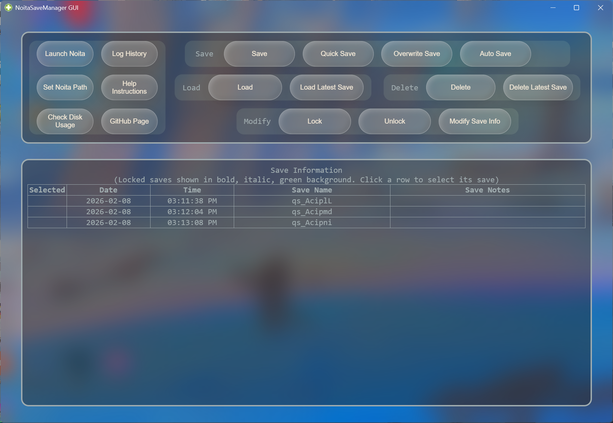
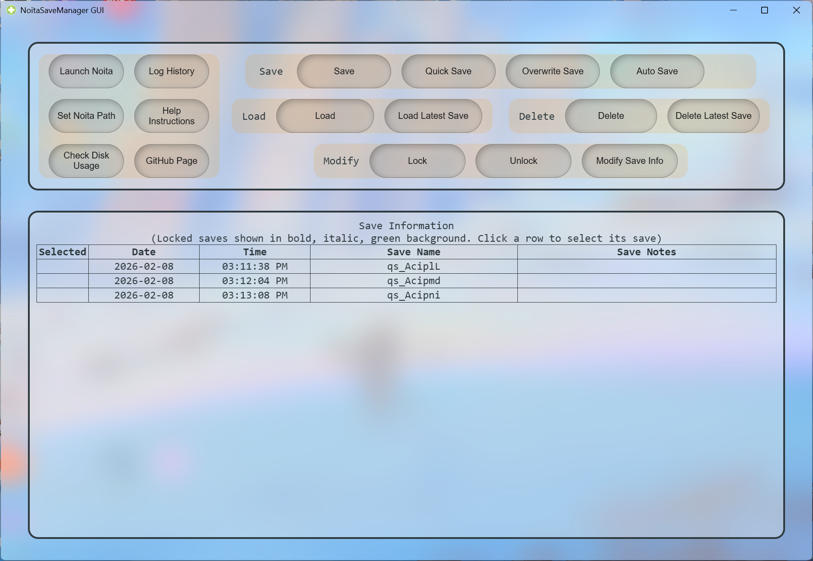
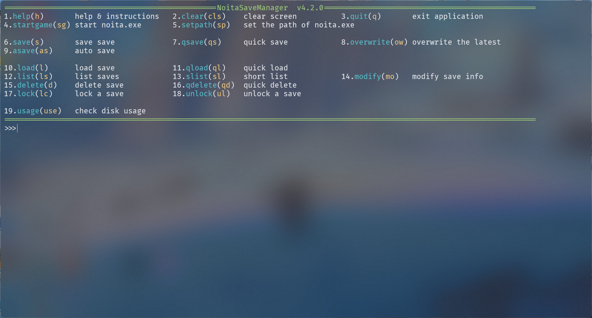

# NoitaSaveManager

> 命令列版本支援***Linux***，可以在Release頁面下載或者使用[安裝腳本](../Linux/install.sh)

|GUI(dark)|GUI(light)|CMD|
|:---:|:---:|:---:|
||||

- [使用說明及注意事項](#使用說明及注意事項)
- [命令列程式使用說明](#命令列程式使用說明)
- [存檔資訊檔案](#存檔資訊檔案)
- [命令列表](#命令列表)

## 使用說明及注意事項

1. 本程式執行時會在程式所在目錄下建立一個 **_Saves 資料夾_**，用於儲存日誌檔案與已保存的存檔，請勿刪除（若刪除，等同於恢復至程式第一次執行的狀態）。

2. 建議將程式放在磁碟中的某個資料夾內，再建立桌面捷徑使用（避免程式在桌面建立 Saves 資料夾後被誤刪）。

3. 請在 Noita 主畫面出現 **「繼續」** 選項時再讀取存檔；若沒有，請先選擇 **「新遊戲」**，再關閉遊戲並重新開啟，之後再點擊 **「繼續」**。

4. 建議關閉 Steam 雲端存檔。

5. 請在 Noita **_正常儲存並關閉_** 後再進行存檔（若在遊戲進行中存檔，實際保存的是 Noita 的 **自動存檔**，可能是幾分鐘前的狀態，而非當下的存檔）。

6. 遊戲進行中請勿讀取存檔。

7. 隨著遊戲進度推進，每次存檔 **所需時間** 與 **佔用空間** 都會不斷 **增加**，請耐心等候。

8. **本程式的命令列版本支援傳入命令列參數。**

9. **使用 GUI 版本時，請注意不要同時多次點擊同一個按鈕。**

10. **命令列版本與 GUI 版本可以共用同一個 Saves 資料夾，但請勿同時執行兩個版本的程式。**

11. 使用本程式啟動 Noita 時，若 Steam 尚未啟動，將無法載入 Steam 中的模組與存檔。

12. 查看 Noita 路徑方式：Steam 收藏庫 → Noita 頁面 → 右側齒輪圖示 → 管理 → 瀏覽本機檔案

## 命令列程式使用說明

1. 命令可以使用完整名稱或縮寫（括號內所示）。

2. 命令有兩種使用方式：**命令參數模式** 與 **一般模式**。
    - **命令參數模式**：使用類似命令列的方式操作，例如
      `save 存檔1 存檔備註`

        在輸入命令時一併輸入參數，各參數以空白分隔。
        若存檔名稱、存檔備註等任何參數中包含空白，請使用 **_英文引號_**（請勿使用 **_中文引號_**）將參數包起來。

        `save "存檔 1" "存檔  備註"`

        各命令在命令參數模式下的格式不同，請使用 `help+命令` 查看該命令的說明與用法。

    - **一般模式**：先輸入命令，再依照程式提示輸入參數，例如：

        ```bash
        >>>save
        請輸入存檔名稱（直接換行則取消儲存）：存檔 1
        請輸入存檔備註（直接換行則不填）：存檔備註
        儲存成功
        ```

3. 使用 `lock` 命令鎖定的存檔 **無法進行任何修改**，請先使用 `unlock` 解鎖後再修改。

4. 使用 `help+命令` 的形式查看某個命令的說明與用法。

5. `del` 與 `lock`、`unlock` 命令支援 **批次操作**，詳情請使用 `help del` 查看用法。

## 存檔資訊檔案

本程式使用 `./Saves/info.json` 檔案來儲存存檔的名稱、備註、日期時間等資訊。
若不熟悉 JSON 檔案格式，建議 **不要手動修改** 此檔案。

```json
{
  "noita_exe_path": "",             // 儲存 Noita 路徑
  "saves": [
    {                               // 每個存檔皆以大括號包裹
      "m_date": "2025年09月20日",   // 儲存日期
      "m_time": "20時58分40秒",     // 儲存時間
      "m_name": "as_zjuu6O",        // 存檔名稱
      "m_note": "",                // 存檔備註
      "m_islocked": true            // 是否鎖定
    },
    ...                             // 中間存檔省略
    {
      "m_date": "2025年09月20日",
      "m_time": "20時58分40秒",
      "m_name": "as_zjuu6O",
      "m_note": "",
      "m_islocked": true
    }                               // 最後一個存檔結尾沒有逗號
  ]
}
```

## 命令列表

|   命令    |     含义     |       简写        |                         说明                         |
| :-------: | :----------: | :---------------: | :--------------------------------------------------: |
|   help    |              |         h         |                  使用教程及帮助说明                  |
|   clear   |              |        cls        |                         清屏                         |
|   quit    |              |     q 或 exit     |                         退出                         |
| startgame |              |        sg         |                      啟動 Noita                      |
|  setpath  |              |        sp         |                設定 noita.exe 的路徑                 |
|   save    |              |         s         |                         保存                         |
|   qsave   |  quick save  |        qs         | 快速保存（無需填寫存檔名稱與備註，存檔名會自動生成） |
| overwrite |              | ow 或 rsave 或 rs |       覆蓋最新存檔（名稱與備註不變，時間更新）       |
|   asave   |  auto save   |        as         |                       自動存檔                       |
|   load    |              |         l         |                         載入                         |
|   qload   |  quick load  |        ql         |                     載入最新存檔                     |
|   list    |              |  ls 或 log 或 lg  |                       存檔列表                       |
|   slist   |  short list  |    sl 或 slog     |                   最近幾次存檔列表                   |
|  modify   | modify save  |        mo         |                     修改存檔資訊                     |
|  delete   |              |         d         |                         刪除                         |
|  qdelete  | quick delete |        qd         |                     刪除最新存檔                     |
|   lock    |              |      lc 或 f      |                       鎖定存檔                       |
|  unlock   |              |     ul 或 uf      |                       解鎖存檔                       |
|   usage   |              |        use        |                     檢視磁碟用量                     |
